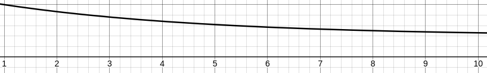

# Spaced repetition system
    
    - system using ai to determine when to show which item

# inputs for the ai:

    (session data)
    1 items_session 
    2 time_session (with respect to start_session & now)

    (word data)
    3 occurrences_session
    4 time_since_last_seen (with respect to last_seen & now)
    5 delta_index (with respect to last seen index and current session index)
    6 amount_reps
    7 is_reversed

    (last reward of word)
    8 accuracy (with respect Exponentially Moving Average (EMA) of accuracy)
    9 last_correct (with respect to typing_start_time)
    10 correct_streak

# saved data:
    
    (word data)
    [0] occurrences_session
    [1] last_seen
    [2] last_seen_index
    [3] n_reps

    (last reward of word)
    [4] EMA
    [5] last_correct (with respect to typing_start_time and correct with respect to word distance)
    [6] correct_streak

    (additional data)
    [7] is reversed

# rewards for the ai:
    delta_ema

# AI architecture:
    ...

# Others

    ·How correct the answer is accounts the time that the user needed to start typing
    This is the curve it uses:
    
    Where 1 and below is considered to be immediate
    