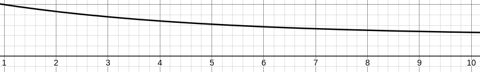

# SRS — Spaced Repetition System

## Overview

A vocabulary learning app built with **Pygame** that quizzes you on word pairs across two languages. You load a *set* (a folder with two parallel CSV vocab lists), and the app shows a source word for you to translate by typing. Answers are checked with fuzzy matching (Levenshtein distance), forgiving small typos.

---

## Core Features

### Vocabulary & Input
- Displays a source word and checks your typed answer
- Short words (≤ 4 chars) must match exactly; longer ones allow 1 edit distance
- After each answer, correct/incorrect is shown in green/red, then the correct translation is briefly revealed

### Gaussian Word Selection
- Words are sampled using a Gaussian distribution over the full vocabulary
- Configurable per set: center (`focused_area`), spread (`sigma_factor`), and floor weight (`min_gauss_weights`)
- Settings persist in per-set config CSVs

### Settings UI
- Interactive coordinate system to reshape the Gaussian curve by dragging
- Click to set peak position and sigma; hold to set the minimum weight floor

### Editing
- You can edit the source or target of the last-shown word pair directly in the app
- Overwrites the CSV line in place

### Inactivity Pause
- After 300 ticks (~10 seconds) of no input, the app pauses until a key is pressed

---

## AI Data

### Inputs for the AI

**Session data**
1. `items_session` — total items answered this session
2. `time_session` — time elapsed since session start

**Word data**
3. `occurrences_session` — how many times this word appeared this session
4. `time_since_last_seen` — derived from `last_seen` and current time
5. `delta_index` — difference between `last_seen_index` and current session index
6. `amount_reps` — total repetitions across all sessions
7. `is_reversed` — whether the word was shown in reverse direction

**Last reward of word**
8. `accuracy` — Exponentially Moving Average (EMA) of past accuracy
9. `last_correct` — correctness score accounting for typing start time
10. `correct_streak` — current consecutive correct streak

---

### Saved Data (per word, per direction)

| Index | Field | Description |
|-------|-------|-------------|
| `[0]` | `occurrences_session` | Appearances this session (reset each run) |
| `[1]` | `last_seen` | Timestamp of last exposure (hours) |
| `[2]` | `last_seen_index` | Session index when last shown |
| `[3]` | `n_reps` | Total repetitions |
| `[4]` | `EMA` | Exponential moving average of accuracy |
| `[5]` | `last_correct` | Typing-speed-adjusted correctness score |
| `[6]` | `correct_streak` | Current correct streak |
| `[7]` | `is_reversed` | Whether word was shown reversed |

---

### Rewards for the AI

$$\Delta_{\text{EMA}} = \text{EMA}_{\text{new}} - \text{EMA}_{\text{old}}$$

The reward is the **delta EMA** — how much the word's accuracy EMA changed after the attempt. Positive = improvement, negative = regression.

---

### AI Architecture

*To be defined.*

---

## Others

### Typing Speed Correction

How correct an answer is accounts for the time the user needed to start typing. The score is clamped to `[0.0, 1.0]` using:

$$\text{score} = \min\!\left(1.0,\ e^{\frac{-t + 1}{4}} \cdot 0.6 + 0.4\right) \quad \text{if correct, else } 0.0$$

where $t$ is the time in seconds between the word appearing and the first keypress.

---
*This summary was generated by Claude (Anthropic).*